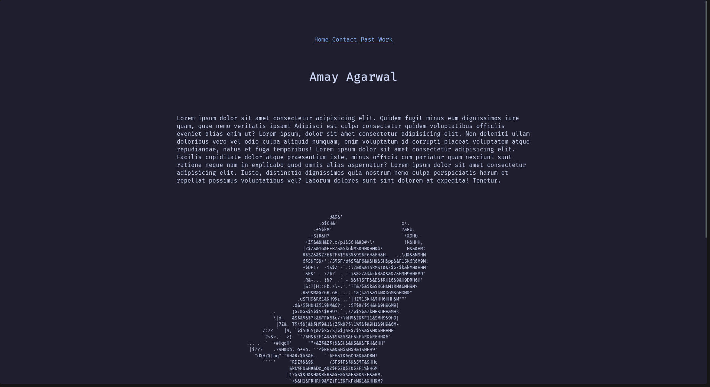
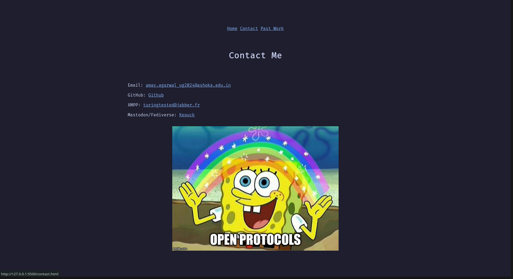
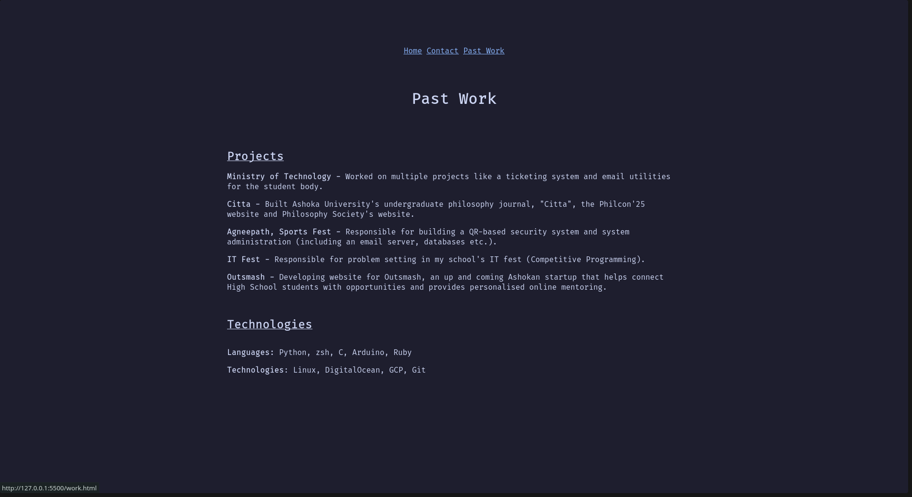

# My portfolio website for ICS Spring '25 Extra credit

Here are some screenshots of the website:





To run the website, simply run `index.html` in any browser of your choice. No libraries or anything external that needs to be installed.
Currently, I have three pages. One is my home page with a little section with an about me (Lorem Ipsum for now). I've also included ASCII art of the BSD Daemon to beautify the website a bit. Apart from that, there is a contacts page and a page showing all the projects I've done in the past.

The directory structure is as follows:

```
├── contact.html
├── index.html
├── public
│   ├── assets
│   │   └── open.jpg
│   └── css
│       └── styles.css
├── README.md
├── readme_screenshots
│   ├── ss1.png
│   ├── ss2.png
│   └── ss3.png
└── work.html
```

This is the output of the tree command verbatim.

